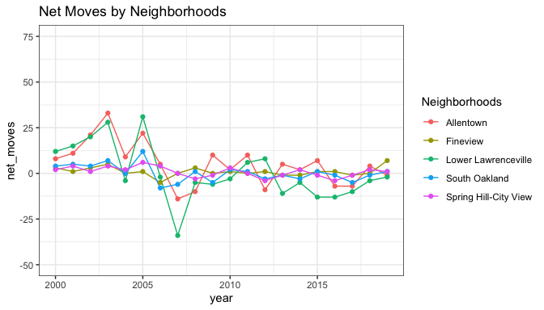
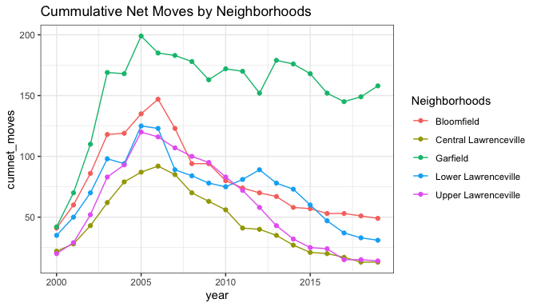

Voucher Resident Move Analysis
================

-   [Housing Choice Voucher Data](#data)
-   [Voucher Resident Movement](#movement)
-   [Moves to Advantage](#advantage)

## Housing Choice Voucher Data<a name="data"></a>

We obtained the records of individuals participating in the Housing
Choice Voucher Program in Allegheny County between 1978 and 2020 from
the Allegheny County Department of Human Services. The dataset was
de-identified. Each observation was composed of the housing voucher
program provider, gender, race, address, and move-in and move-out dates
of each participant. Although the records contained all household
members participating in the housing choice voucher program, we limited
our analyses to heads of household. From here on, we refer to those
heads of household as voucher residents.

``` r
library(tidyverse)
library(lubridate)
library(kableExtra)
library(scales)

theme_set(theme_bw())

neighbor <- read_csv("./data/voucher_with_neighborhood_Apr6.csv")

df <- neighbor %>%
  select(
    HA, CLIENT_ID, GENDER, RACE, RELATIONSHIP, MOVEINDATE, MOVEOUTDATE, PRIMARYSTREET, ZIP, geocoder_recognized_address, neighborhood, geoid10) %>%
  mutate(year_movein = year(MOVEINDATE),
         year_moveout = year(MOVEOUTDATE),
         hood = neighborhood
         ) %>%
  select(-neighborhood)

base_df <- df %>%
  select(-c(geocoder_recognized_address, geoid10))
```

``` r
# community index dataset
index <- read_csv("./data/community_index/all_final.csv")

df_index <- index %>%
  mutate(hood_2 = toupper(hood_2)) %>%
  pivot_longer(!hood_2, names_to = "to_year") %>%
  mutate(to_year = as.double(to_year), category = value) %>%
  select(-value)

df <- df %>%
  mutate(hood = toupper(hood)) %>%
  left_join(df_index, by=c('hood'='hood_2', "year_moveout"="to_year")) %>%
  mutate(hood = str_to_title(hood, locale = "en"))
```

``` r
total <- df %>%
  distinct(CLIENT_ID) %>%
  nrow()

lower <- df %>% 
  filter(hood == "Lower Lawrenceville") %>%
  select(CLIENT_ID) %>%
  unique() %>%
  nrow()
```

The data contained 25662 unique households. The majority of voucher
residents were black, followed by white (See Table 1). Voucher residents
in Lower Lawrenceville showed a similar gender composition to voucher
holders in Allegheny County (82% female). Out of 366 households in Lower
Lawrenceville, most voucher holders were female. However, the proportion
of black housing voucher holders was higher in Lower Lawrenceville than
in Allegheny County (See Table 2). Approximately 80% were black in Lower
Lawrenceville compared to 72% in Allegheny County.

``` r
# plot gender and race distributions
df %>%
  distinct(CLIENT_ID, GENDER) %>%
  group_by(GENDER) %>%
  summarise(COUNT = n()) %>%
  mutate("%" = round(COUNT/sum(COUNT)*100, 2)) %>%
  kbl() %>%
  kable_styling(bootstrap_options = "striped", full_width = F, position = "left")
```

<table class="table table-striped" style="width: auto !important; ">
<thead>
<tr>
<th style="text-align:left;">
GENDER
</th>
<th style="text-align:right;">
COUNT
</th>
<th style="text-align:right;">
%
</th>
</tr>
</thead>
<tbody>
<tr>
<td style="text-align:left;">
Female
</td>
<td style="text-align:right;">
21121
</td>
<td style="text-align:right;">
82.30
</td>
</tr>
<tr>
<td style="text-align:left;">
Male
</td>
<td style="text-align:right;">
4514
</td>
<td style="text-align:right;">
17.59
</td>
</tr>
<tr>
<td style="text-align:left;">
Unknown
</td>
<td style="text-align:right;">
27
</td>
<td style="text-align:right;">
0.11
</td>
</tr>
</tbody>
</table>

``` r
df %>%
  distinct(CLIENT_ID, RACE) %>%
  group_by(RACE) %>%
  summarise(COUNT = n()) %>%
  mutate("%" = round(COUNT/sum(COUNT)*100, 2)) %>%
  kbl() %>%
  kable_styling(bootstrap_options = "striped", full_width = F, position = "left")
```

<table class="table table-striped" style="width: auto !important; ">
<thead>
<tr>
<th style="text-align:left;">
RACE
</th>
<th style="text-align:right;">
COUNT
</th>
<th style="text-align:right;">
%
</th>
</tr>
</thead>
<tbody>
<tr>
<td style="text-align:left;">
American Indian/Alaska Native
</td>
<td style="text-align:right;">
73
</td>
<td style="text-align:right;">
0.28
</td>
</tr>
<tr>
<td style="text-align:left;">
Asian
</td>
<td style="text-align:right;">
65
</td>
<td style="text-align:right;">
0.25
</td>
</tr>
<tr>
<td style="text-align:left;">
Black/African American
</td>
<td style="text-align:right;">
18595
</td>
<td style="text-align:right;">
72.46
</td>
</tr>
<tr>
<td style="text-align:left;">
Multi-Racial
</td>
<td style="text-align:right;">
215
</td>
<td style="text-align:right;">
0.84
</td>
</tr>
<tr>
<td style="text-align:left;">
Native Hawaiian/Other Pacific Islander
</td>
<td style="text-align:right;">
30
</td>
<td style="text-align:right;">
0.12
</td>
</tr>
<tr>
<td style="text-align:left;">
White
</td>
<td style="text-align:right;">
6684
</td>
<td style="text-align:right;">
26.05
</td>
</tr>
</tbody>
</table>

## Lower Lawrenceville Voucher Resident Movement<a name="movement"></a>

``` r
# get clients who lived in LL and filter to those clients
lower_id <- df %>% 
  filter(hood == "Lower Lawrenceville") %>%
  select(CLIENT_ID) %>%
  unique()

target <- pull(lower_id, CLIENT_ID)

df_lower <- df %>%
  filter(CLIENT_ID %in% target)

# check number of clients in LL: passed
# df_lower %>%
#   select(CLIENT_ID) %>%
#   unique()
```

``` r
df_lower %>% 
  distinct(CLIENT_ID, GENDER) %>%
  group_by(GENDER) %>%
  summarise(COUNT = n()) %>%
  mutate("%" = round(COUNT/sum(COUNT)*100, 2)) %>%
  kbl() %>%
  kable_styling(bootstrap_options = "striped", full_width = F, position = "left") 
```

<table class="table table-striped" style="width: auto !important; ">
<thead>
<tr>
<th style="text-align:left;">
GENDER
</th>
<th style="text-align:right;">
COUNT
</th>
<th style="text-align:right;">
%
</th>
</tr>
</thead>
<tbody>
<tr>
<td style="text-align:left;">
Female
</td>
<td style="text-align:right;">
302
</td>
<td style="text-align:right;">
82.51
</td>
</tr>
<tr>
<td style="text-align:left;">
Male
</td>
<td style="text-align:right;">
64
</td>
<td style="text-align:right;">
17.49
</td>
</tr>
</tbody>
</table>

``` r
df_lower %>% 
  distinct(CLIENT_ID, RACE) %>%
  group_by(RACE) %>%
  summarise(COUNT = n()) %>%
  mutate("%" = round(COUNT/sum(COUNT)*100, 2)) %>%
  kbl() %>%
  kable_styling(bootstrap_options = "striped", full_width = F, position = "left")
```

<table class="table table-striped" style="width: auto !important; ">
<thead>
<tr>
<th style="text-align:left;">
RACE
</th>
<th style="text-align:right;">
COUNT
</th>
<th style="text-align:right;">
%
</th>
</tr>
</thead>
<tbody>
<tr>
<td style="text-align:left;">
Black/African American
</td>
<td style="text-align:right;">
293
</td>
<td style="text-align:right;">
80.05
</td>
</tr>
<tr>
<td style="text-align:left;">
Multi-Racial
</td>
<td style="text-align:right;">
4
</td>
<td style="text-align:right;">
1.09
</td>
</tr>
<tr>
<td style="text-align:left;">
White
</td>
<td style="text-align:right;">
69
</td>
<td style="text-align:right;">
18.85
</td>
</tr>
</tbody>
</table>

We found the record of moves from 1989 and the number of moves to Lower
Lawrenceville started going up in the late 1990s and peaked in 2005 (See
Chart 8). For the number of moves from Lower Lawrenceville, we found
that the record began in 2003 and peaked in 2007. For those who have
subsequent movement records, we looked at which neighborhoods voucher
holders in Lower Lawrenceville moved to between 2003 and 2019. Most of
these households stayed in Lower Lawrenceville or moved to neighborhoods
nearby, such as Garfield, East Liberty, and Upper Lawrenceville (See
Chart 9).

``` r
# get clients who lived in LL and filter to those clients
lower_id <- df %>% 
  filter(hood == "Lower Lawrenceville") %>%
  select(CLIENT_ID) %>%
  unique()

target <- pull(lower_id, CLIENT_ID)

df_lower <- df %>%
  filter(CLIENT_ID %in% target)

# clients with more than one record who lived in LL at least once
# filter to clients with record > 1 because clients of clients who movedin and moveout in the same year
df_lower2 <- df_lower %>%
  group_by(CLIENT_ID) %>%
  filter(n() > 1) %>%
  ungroup()

df_lower2_copy <- df_lower2 %>%
  select(CLIENT_ID, MOVEINDATE, MOVEOUTDATE, hood, category)

df_lower2_joined <- df_lower2 %>% 
  left_join(df_lower2_copy, by="CLIENT_ID") %>%
  filter(year(MOVEOUTDATE.x) == year(MOVEINDATE.y)) %>%
  select(CLIENT_ID, RACE, MOVEINDATE.x, MOVEOUTDATE.x, MOVEINDATE.y, hood.x, hood.y, category.x, category.y) %>%
  filter(hood.x == "Lower Lawrenceville") %>%
  arrange(CLIENT_ID, MOVEINDATE.x) %>%
  mutate(year_moveout = year(MOVEOUTDATE.x), neighborhood_to = hood.y, category_from = category.x, category_to = category.y) %>%
  select(-hood.y, -category.x, -category.y) %>%
  mutate(
    category = case_when(
      category_from > category_to ~ "Advantage",
      category_from == category_to ~ "Comparable",
      category_from < category_to ~ "Disavantage")
    )
```

``` r
base_df %>%
  filter(hood == "Lower Lawrenceville") %>%
  select(CLIENT_ID, year_movein, year_moveout) %>%
  pivot_longer(!CLIENT_ID, names_to = "Type", names_prefix = "year_", values_to = "Year") %>%
  group_by(Year, Type) %>%
  summarise(Count = n()) %>%
  ggplot(aes(Year, Count, group=Type, color=Type)) +
  geom_point() + geom_line() +
  labs(title = "Number of Moves by Year")
```

<!-- -->

``` r
df_lower2_joined %>% 
  group_by(neighborhood_to) %>%
  summarise(Count = n()) %>%
  arrange(desc(Count)) %>%
  head(10) %>%
  ggplot(aes(x=reorder(neighborhood_to,Count), y=Count)) + 
  geom_point(size=1.5) +
  labs(title = "Top 10 Neighborhoods HCV Holders in Lower Lawrenceville Moved to") +
  xlab("Neighborhood") +
  ylab("Count") +
  coord_flip() 
```

<!-- -->

Although the total number of voucher holders moving out from Lower
Lawrenceville has decreased since 2007, the proportion of those moving
to Lower Lawrenceville or nearby areas has also declined. Chart 10 shows
the proportion of Lower Lawrenceville voucher holders moving to Lower
Lawrenceville, Central Lawrenceville, Upper Lawrenceville, Garfield, or
Bloomfield.

``` r
nearby <- c("Lower Lawrenceville", "Central Lawrenceville", "Upper Lawrenceville", "Garfield", "Bloomfield")

df_lower2_joined %>%
  group_by(year_moveout, neighborhood_to) %>%
  summarise(COUNT = n()) %>%
  mutate("%" = round(COUNT/sum(COUNT)*100, 2)) %>%
  filter(neighborhood_to %in% nearby) %>%
  group_by(year_moveout) %>%
  summarise('%' = sum(`%`),
            "total_count" = sum(COUNT)) %>%
  add_row(year_moveout = 2019, `%` = 0, `total_count` = 0) %>%
  ggplot(aes(year_moveout, `%`)) +
  geom_point(aes()) +
  geom_line(aes()) +
  labs(title = "Percent of Voucher Holders Moving to Lower Lawrenceville or Nearby Areas") +
  xlab("YEAR") 
```

<!-- -->

``` r
df_lower2_joined %>%
  group_by(year_moveout, neighborhood_to) %>%
  summarise(COUNT = n()) %>%
  mutate("%" = round(COUNT/sum(COUNT)*100, 2)) %>%
  filter(neighborhood_to %in% nearby) %>%
  group_by(year_moveout) %>%
  summarise('%' = sum(`%`),
            "total_count" = sum(COUNT)) %>%
  add_row(year_moveout = 2019, `%` = 0, `total_count` = 0) %>%
  ggplot(aes(year_moveout, `total_count`)) +
  geom_point() +
  geom_line() +
  labs(title = "Number of Voucher Holders Moving to Lower Lawrenceville or Nearby Areas") +
  xlab("YEAR") + ylab("COUNT") 
```

<!-- -->

We analyzed the movements of voucher holders in Lower Lawrenceville.
Specifically, we examined the number of households that moved out each
year, the neighborhoods they moved to most frequently, and if the
neighborhoods they moved to are better, comparable, or worse than the
condition of Lower Lawrenceville. We also looked at the movements of
voucher holders in comparable and nearby neighborhoods to see if
movements in Lower Lawrenceville are similar to or different. These
analyses leverage our neighborhood disadvantage index detailed in the
previous section, which is used to determine if a move in any one year
is considered one to better, comparable, or worse advantage.

We looked at how frequently voucher holders moved from and into Lower
Lawrenceville. For each year, we calculated the net moves by subtracting
the number of households that moved out from the number of households
that moved into Lower Lawrenceville. As shown in Chart 11, a
considerably large number of households moved out in 2007, and after
2007, a roughly equal number of families moved out of and into Lower
Lawrenceville. The analysis of nearby neighborhoods showed a similar
trend, except in Garfield. The total number of households that moved out
of Bloomfield, Upper Lawrenceville, Central Lawrenceville, and Lower
Lawrenceville was higher than the number of households that moved in
over this span.

``` r
# moveout by year analysis (clients with subsequent + no subsequent move records)
# compared to other neighborhoods

comparable <- c("Allentown", "Fineview", "Lower Lawrenceville", "South Oakland", "Spring Hill-City View")

net_df_nearby <- base_df %>%
  filter(hood %in% nearby) %>%
  mutate(year_movein = year(MOVEINDATE), total = 1) %>%
  select(CLIENT_ID, year_movein, year_moveout, hood) %>%
  pivot_longer(cols = starts_with("year"),
             names_to = "type",
             values_to = "year",
             names_prefix = "year_move") %>%
  group_by(hood, year, type) %>%
  summarise(total = n()) %>%
  pivot_wider(names_from = type, values_from = total, values_fill = 0) %>%
  mutate(net_moves = `in` - `out`) %>%
  group_by(hood) %>%
  mutate(cumnet_moves = cumsum(net_moves)) 

net_df_comparable <- base_df %>%
  filter(hood %in% comparable) %>%
  mutate(year_movein = year(MOVEINDATE), total = 1) %>%
  select(CLIENT_ID, year_movein, year_moveout, hood) %>%
  pivot_longer(cols = starts_with("year"),
             names_to = "type",
             values_to = "year",
             names_prefix = "year_move") %>%
  group_by(hood, year, type) %>%
  summarise(total = n()) %>%
  pivot_wider(names_from = type, values_from = total, values_fill = 0) %>%
  mutate(net_moves = `in` - `out`) %>%
  group_by(hood) %>%
  mutate(cumnet_moves = cumsum(net_moves))
```

``` r
net_df_nearby %>%
  filter(year > 1999) %>%
  ggplot(aes(year, net_moves, group=hood, color=hood)) +
  geom_line() + geom_point() + 
  ylim(-50, 75) + labs(colour = "Neighborhoods") +
  labs(title = "Net Moves by Neighborhoods")   
```

<!-- -->

``` r
net_df_comparable %>%
  filter(year > 1999) %>%
  ggplot(aes(year, net_moves, group=hood, color=hood)) +
  geom_line() + geom_point() + 
  ylim(-50, 75) + labs(colour = "Neighborhoods") +
  labs(title = "Net Moves by Neighborhoods")   
```

<!-- -->

``` r
net_df_nearby %>%
  filter(year > 1999) %>%
  ggplot(aes(year, cumnet_moves, group=hood, color=hood)) +
  geom_line() + geom_point() + labs(colour = "Neighborhoods") +
  labs(title = "Cummulative Net Moves by Neighborhoods")
```

<!-- -->

``` r
net_df_comparable %>%
  filter(year > 1999) %>%
  ggplot(aes(year, cumnet_moves, group=hood, color=hood)) +
  geom_line() + geom_point() + labs(colour = "Neighborhoods") +
  labs(title = "Cummulative Net Moves by Neighborhoods")
```

<!-- -->

We also compared net moves in Lawrenceville between 2000 and 2019 to net
moves in our four baseline neighborhoods over the same period. As shown
in Chart 12, since 2007, Lower Lawrenceville has had more outflows than
its comparable neighborhoods on average.

The cumulative net move shows the total number of voucher holder
households in a neighborhood each year. Including Lower Lawrenceville,
the number of voucher holder households in the nearby neighborhoods
increased until 2007 but dramatically declined in the following years
(See Chart 13), with the exception of Garfield, where the decline in the
number of voucher holder households was relatively small. Contrary to
those in nearby neighborhoods, the number of voucher holder households
in comparable neighborhoods did not change significantly since 2007 (See
Chart 14). Although the number of voucher households in Allentown
mirrored that of Lawrenceville in its dramatic increase between 2000 and
2007, the decrease in the number of voucher holders in Allentown after
2007 was relatively small, in contrast to the sharp decline in the
number of voucher holders in Lower Lawrenceville after 2007.

## Moves to Advantage<a name="advantage"></a>

Next, we looked at whether voucher holders subsequently moved to better,
comparable, or worse neighborhoods than Lower Lawrenceville. The
neighborhood index showed that Lower Lawrenceville’s disadvantage score
improved significantly in the 2010s (See Table 3). We analyzed voucher
holder movements in Lower Lawrenceville from 2010, which is as far back
as we could calculate the index for the observation period of interest
using census data. We found only 44 voucher holders with subsequent
movement records. More households moved to comparable or better
neighborhoods in the early 2010s, but as Lower Lawrenceville’s
disadvantage score improved in the late 2010s, many households moved to
more disadvantaged neighborhoods (See Chart 15). Additionally, we did
not find a racial difference in movement. Among both black and white
households, two-thirds moved to comparable or better neighborhoods (See
Table 4). Due to the small number of households (1 household in total),
we excluded the multi-racial group from this analysis.

``` r
df_lower2_joined %>%
  mutate(type = category) %>%
  group_by(year_moveout, type) %>%
  summarise(count = n()) %>%
  ggplot(aes(year_moveout, count, group=type, color=type)) +
  geom_line() + geom_point() +
  labs(title = "Moves in Lower Lawrenceville by Neighborhood Type")
```

<!-- -->

``` r
# count format
df_lower2_joined %>%
  mutate(Category = category) %>%
  group_by(RACE, Category) %>%
  summarise(COUNT = n()) %>%
  pivot_wider(names_from = RACE, values_from = COUNT, values_fill = 0) %>%
  kbl(caption = "Movement Analysis by Race") %>%
  kable_styling(bootstrap_options = "striped", full_width = F, position = "left")
```

<table class="table table-striped" style="width: auto !important; ">
<caption>
Movement Analysis by Race
</caption>
<thead>
<tr>
<th style="text-align:left;">
Category
</th>
<th style="text-align:right;">
Black/African American
</th>
<th style="text-align:right;">
Multi-Racial
</th>
<th style="text-align:right;">
White
</th>
</tr>
</thead>
<tbody>
<tr>
<td style="text-align:left;">
Advantage
</td>
<td style="text-align:right;">
17
</td>
<td style="text-align:right;">
0
</td>
<td style="text-align:right;">
3
</td>
</tr>
<tr>
<td style="text-align:left;">
Comparable
</td>
<td style="text-align:right;">
13
</td>
<td style="text-align:right;">
0
</td>
<td style="text-align:right;">
2
</td>
</tr>
<tr>
<td style="text-align:left;">
Disavantage
</td>
<td style="text-align:right;">
15
</td>
<td style="text-align:right;">
1
</td>
<td style="text-align:right;">
4
</td>
</tr>
</tbody>
</table>

``` r
# percent format
df_lower2_joined %>%
  mutate(Category = category) %>%
  group_by(RACE, Category) %>%
  summarise(COUNT = n()) %>%
  mutate("%" = percent(COUNT/sum(COUNT), accuracy = .1)) %>%
  select(-COUNT) %>%
  pivot_wider(names_from = RACE, values_from = "%", values_fill = "0%") %>%
  kbl(caption = "Movement Analysis by Race") %>%
  kable_styling(bootstrap_options = "striped", full_width = F, position = "left")
```

<table class="table table-striped" style="width: auto !important; ">
<caption>
Movement Analysis by Race
</caption>
<thead>
<tr>
<th style="text-align:left;">
Category
</th>
<th style="text-align:left;">
Black/African American
</th>
<th style="text-align:left;">
Multi-Racial
</th>
<th style="text-align:left;">
White
</th>
</tr>
</thead>
<tbody>
<tr>
<td style="text-align:left;">
Advantage
</td>
<td style="text-align:left;">
37.8%
</td>
<td style="text-align:left;">
0%
</td>
<td style="text-align:left;">
33.3%
</td>
</tr>
<tr>
<td style="text-align:left;">
Comparable
</td>
<td style="text-align:left;">
28.9%
</td>
<td style="text-align:left;">
0%
</td>
<td style="text-align:left;">
22.2%
</td>
</tr>
<tr>
<td style="text-align:left;">
Disavantage
</td>
<td style="text-align:left;">
33.3%
</td>
<td style="text-align:left;">
100.0%
</td>
<td style="text-align:left;">
44.4%
</td>
</tr>
</tbody>
</table>
